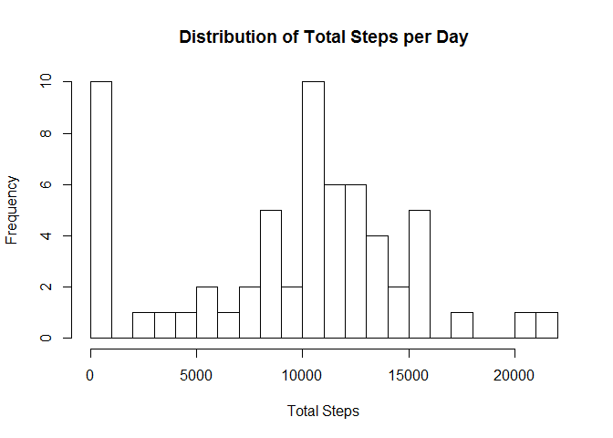
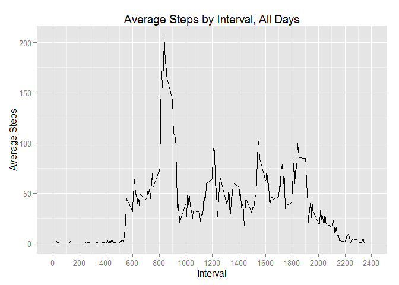
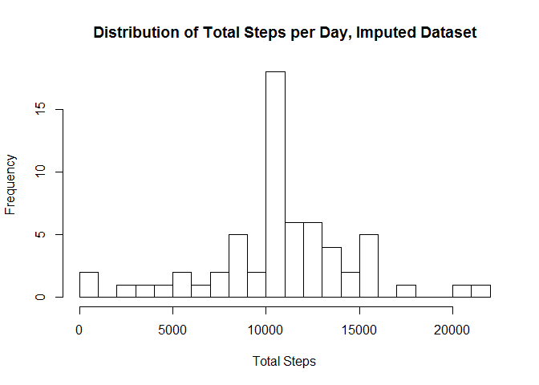
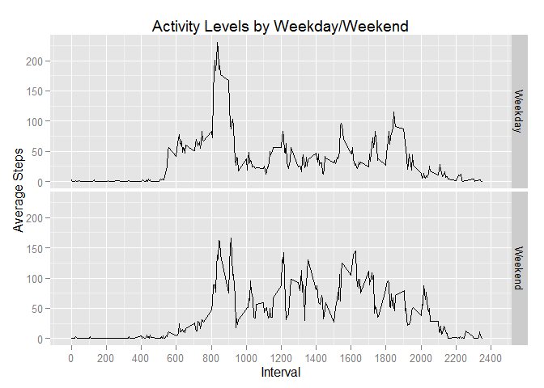

# Reproducible Research: Peer Assessment 1
Jordan Grimstad  


## Loading and preprocessing the data
Assuming we're starting straight with the cloned data, we have to first unzip the package to the working directory and read in the csv.

```r
unzip("activity.zip") #unpack activity.zip file
activity <- read.csv("activity.csv") #read in activity.csv
```
Because the csv is already pretty well labeled/organized, there's no need to do any pre-processing to make this data work for our purposes.


## What is mean total number of steps taken per day?
To visualize the total number of steps taken per day, I aggregate the data by date and use a simple histogram to show typical activity levels. Then, I calculate median and mean values on the aggregated data.frame, and print them to the console.


```r
## Aggregate the data to prepare for the analysis
stepsByDay <- aggregate(activity$steps,
      by=list(activity$date), 
      FUN=sum, na.rm=TRUE) # Get data.frame with total steps by day
colnames(stepsByDay) <- c("Date", "Total.Steps") # Clean up var names

## Create histogram showing the distribution of total steps per day
hist(stepsByDay$Total.Steps, breaks = 20, 
      main = "Distribution of Total Steps per Day", 
      xlab = "Total Steps")
```

 

```r
## Calculate & report on the mean and median steps by day
avgStepsByDay <- mean(stepsByDay$Total.Steps, 
      na.rm = TRUE) # Calculate mean steps by day
medStepsByDay <- median(stepsByDay$Total.Steps, 
      na.rm = TRUE) # Calculate median steps by day
paste("Average steps per day is", round(avgStepsByDay),
      "and median steps per day is", 
      medStepsByDay)
```

```
## [1] "Average steps per day is 9354 and median steps per day is 10395"
```

## What is the average daily activity pattern?
To visualize the average daily activity pattern, I first aggregate the data by interval and apply the mean function to it, removing NAs. Then, I produce a time series plot in `ggplot2`. Finally, I isolate the row containing the maximum value for average steps and print the interval value to the console in a neat format.

```r
library(ggplot2)

## Aggregate the data to set up for the analysis
stepsByInterval <- aggregate(activity$steps,
      by=list(activity$interval), 
      FUN=mean, 
      na.rm = TRUE)
colnames(stepsByInterval) <- c("Interval", "Avg.Steps")
rownames(stepsByInterval) <- stepsByInterval$Interval

## Create plot of average steps by interval across all days
g <- ggplot(stepsByInterval, aes(Interval, Avg.Steps)) # Initialize plot
g <- g + scale_x_continuous(limits=c(0, 2400), 
      breaks=seq(from=0, to=2400, by=200)) # Scale the x-axis
g <- g + geom_line() # Add a line
g <- g + ggtitle("Average Steps by Interval, All Days") # Change the title
g <- g + ylab("Average Steps") # Relabel the y-axis
g
```

 

```r
## Calculate and report the interval where step count tends to be the highest
maxInt <- stepsByInterval[stepsByInterval$Avg.Steps ==
      max(stepsByInterval$Avg.Steps), ] # Isolate row containing max interval
paste("The maximum average daily steps occurs at interval ",
      maxInt$Interval, 
      "; on average, the daily steps during this interval are ",
      round(maxInt$Avg.Steps), sep="")
```

```
## [1] "The maximum average daily steps occurs at interval 835; on average, the daily steps during this interval are 206"
```


## Imputing missing values
To handle missing values, first I report on the number of missing values in the dataset. Then, I decide that my strategy for filling in these NAs is to replace them with the average total steps for that interval from the non-NA values. Using the `stepsByInterval` data.frame from the previous step, I find the NA values and replace them with the averages, creating a data.frame called `activityImp` that is identical to `activity` except with NA values replaced by averages.


```r
##Calculate & report on total # of missings
paste("There are a total of", sum(is.na(activity$steps)), 
      "missing step values in the dataset")
```

```
## [1] "There are a total of 2304 missing step values in the dataset"
```

```r
##Create new dataset with NAs filled in
activityImp <- activity # copy the data.frame
impInd <- which(is.na(activity$steps)) # getting the indices of values that need replacing
impIntervals <- activity$interval[impInd] # get a list of the intervals that need replacing, in order
replVals <- stepsByInterval[as.character(impIntervals),2] # generate the list of replacement values
activityImp$steps <- as.numeric(replace(activity$steps, impInd, replVals)) # replace the NA values in activityImp

##Make a histogram showing total # of steps taken each day
stepsByDayImp <- aggregate(activityImp$steps,
      by=list(activityImp$date), 
      FUN=sum, na.rm=TRUE) # Calc data.frame with total steps by day
colnames(stepsByDayImp) <- c("Date", "Total.Steps") # Clean up var names
hist(stepsByDayImp$Total.Steps, breaks = 20, 
      main = "Distribution of Total Steps per Day, Imputed Dataset", 
      xlab = "Total Steps") # Generate histogram
```

 

```r
##Calculate and report on the mean & median total number of steps each day
paste("The mean number of steps taken each day is",
      round(mean(stepsByDayImp$Total.Steps)), 
      "and the median number of steps taken each day is",
      round(median(stepsByDayImp$Total.Steps)))
```

```
## [1] "The mean number of steps taken each day is 10766 and the median number of steps taken each day is 10766"
```
These mean and median values do, in fact, differ from those reported in the first part of the assignment. Imputing missing data in this fashion removes data from the bottom half of the set and puts it square in the middle, more-or-less enforcing the non-NA mean/median values while functionally increasing the un-imputed dataset's mean and median values.

In general, imputing values for missing data reduces the skew in the data, but doesn't necessarily add accuracy - the subject may have taken more or fewer steps than the tracked average on that particular day. We may be better off simply discarding the NA data outright, since it may overstate how frequently the subject has an "average" day of steps.


## Are there differences in activity patterns between weekdays and weekends?


```r
library(plyr) # load plyr to get mapvalues function
activityImp$dayOfWeek <- weekdays(as.POSIXct(activityImp$date)) # create column with day names
activityImp$dayOfWeek <- as.factor(mapvalues(activityImp$dayOfWeek, 
          from = c("Monday", "Tuesday", "Wednesday","Thursday", 
                   "Friday", "Saturday", "Sunday"),
          to = c("Weekday", "Weekday", "Weekday", "Weekday", 
                 "Weekday", "Weekend", "Weekend"))) # map days to weekday/weekend levels

weekBreakdown <- aggregate(activityImp$steps, 
                           by=list(activityImp$interval,
                                   activityImp$dayOfWeek), 
                           FUN=mean)
colnames(weekBreakdown) <- c("Interval", "Day.Type", "Avg.Steps")
g <- ggplot(weekBreakdown, aes(Interval, Avg.Steps))
g <- g + facet_grid(Day.Type~.)
g <- g + geom_line()
g <- g + scale_x_continuous(limits=c(0,2400),
                            breaks=seq(from=0,to=2400,by=200))
g <- g + ggtitle("Activity Levels by Weekday/Weekend")
g <- g + xlab("Interval")
g <- g + ylab("Average Steps")
g
```

 

At first glance, it appears that weekdays have more activity than weekends due to a higher morning peak. However, after closer inspection, weekend activity tends to be sustained more throughout the day vs. weekdays, which are characterized by an early morning spike and then a significant drop-off in activity throughout the day.
